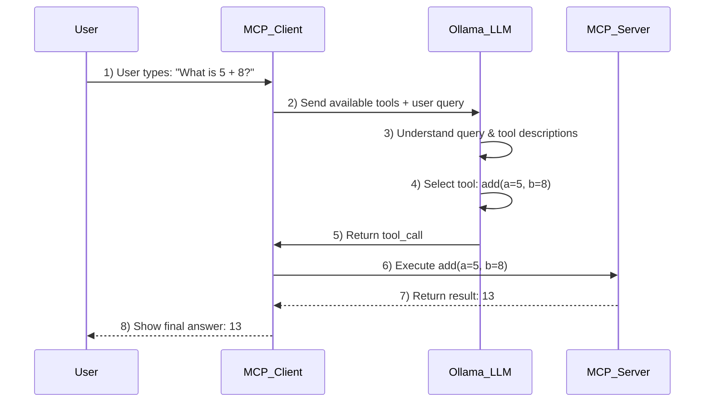

# MCP + Ollama Local Tool Calling Example

This project demonstrates how a local AI agent can **understand user queries** and **automatically call Python functions** using:

- Model Context Protocol (**MCP**)
- **Ollama** for running a local LLM (e.g., Llama3)
- **Python** MCP Client and Server

---

## 🔗 Sequence Diagram



---

## 📚 Project Structure

```
.
├── math_server.py      # MCP Server exposing add() and multiply() tools
├── ollama_client.py    # MCP Client interacting with Ollama
├── README.md           # Project documentation
```

---

## 🛠️ Setup Instructions

### 1. Install Requirements

```bash
pip install "mcp[cli] @ git+https://github.com/awslabs/mcp.git" openai==0.28 httpx
```

Make sure you have **Ollama installed** and running.

### 2. Pull or run an LLM model

```bash
ollama run llama3
```

(Ensure the model you run supports tool calling.)

### 3. Run the MCP Server

```bash
python math_server.py
```

The server exposes two simple tools:
- `add(a: int, b: int) -> int`
- `multiply(a: int, b: int) -> int`

### 4. Run the MCP Client

```bash
python ollama_client.py math_server.py
```

### 5. Interact!

Example queries:

```
Query: What is 5 + 8?
Response: 13

Query: Multiply 7 and 9
Response: 63
```

The MCP client sends the query and available tools to Ollama. The LLM internally decides which tool to use based on the tool descriptions and user intent.

---

## 🚀 How It Works

- MCP Client lists available tools.
- Sends tools + user query to Ollama LLM.
- LLM reasons about the best matching tool.
- LLM generates a `tool_call`.
- MCP Client invokes the function via the MCP Server.
- Final result is returned and displayed.

✅ No manual hardcoding!
✅ Everything runs locally!
✅ Fully autonomous!

---

## 📢 Why This Matters

This pattern enables building **smart local AI agents** that:
- Understand user intent
- Dynamically select the correct actions
- Operate fully offline and locally

It opens doors for:
- Autonomous developers
- Local intelligent assistants
- Secure AI workflows

---

## 🏷️ Hashtags for Sharing

```text
#MCP #ModelContextProtocol #Ollama #LocalLLM #FunctionCalling #Python #AI #DeveloperTools #AIEngineering #AutonomousAgents
```

---

## 🙌 Credits

- [Model Context Protocol](https://modelcontextprotocol.io)
- [Ollama](https://ollama.com)

---

> "Smarter AI agents start with understanding how they think!"

---

> **Next Steps:** Add Streamlit UI or Dockerize this project 🚀
